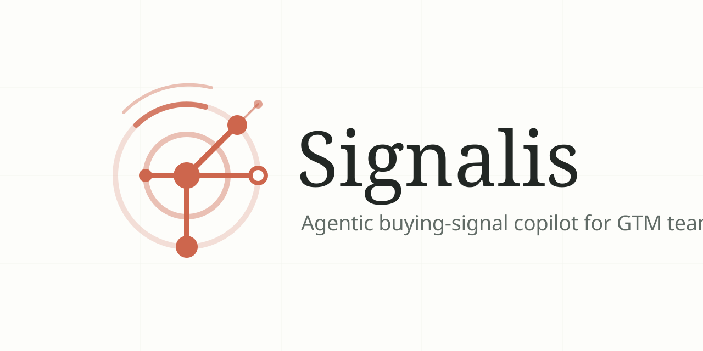
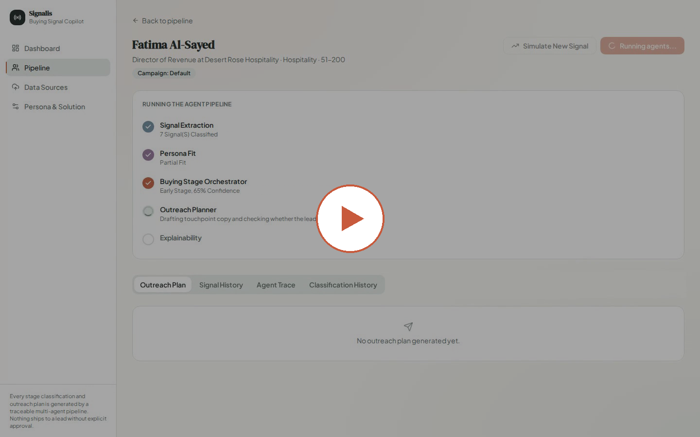
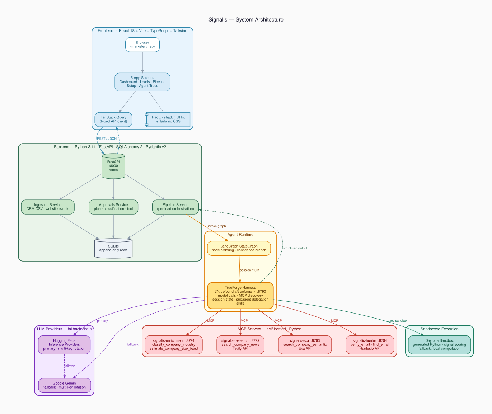
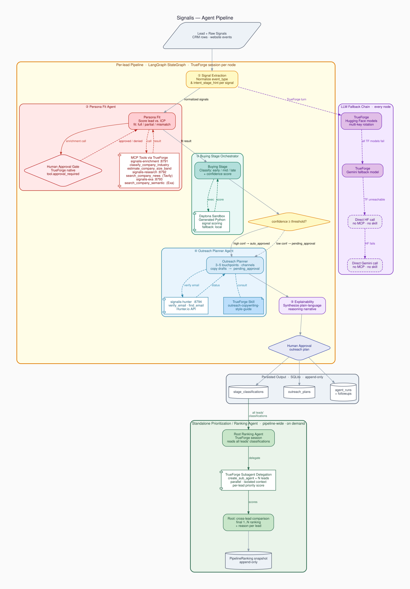

<p align="center">
  
</p>

# Signalis

**An agentic buying-signal copilot for GTM teams.** Signalis ingests CRM and
website activity, classifies each lead's buying stage with explainable,
LLM-generated reasoning, and drafts an outreach plan a rep can approve and
send — re-running automatically whenever new signals arrive.

## Demo

<p align="center">
  <a href="demo/signalis_demo_narrated.mp4">
    
  </a>
</p>

<p align="center"><em>▶ Click to watch — a real, live pipeline run: multi-campaign targeting, agent-by-agent progress, explainable classification, and a copy-ready outreach plan, narrated end to end.</em></p>

## What it does

- Turns raw CRM rows and website events into normalized, stage-tagged signals
- Scores each lead against a marketer-defined persona and solution ICP
- Classifies buying stage (early / mid / late) with confidence + plain-language reasoning
- Drafts a 1–2 week outreach plan (touchpoints, channels, ready-to-send copy)
- Runs every campaign against its own persona and solution — not one global config
- Gates every plan behind human approval before it's considered final
- Re-classifies automatically the moment a new signal lands
- Ranks the whole pipeline by contact priority, with a reason per lead

## Architecture at a glance

| Layer | Stack |
|---|---|
| Backend | Python 3.11+, FastAPI, SQLAlchemy 2.x, SQLite, Pydantic v2 |
| Agents | LangGraph `StateGraph` coordinating 5 pipeline agents + a standalone ranking agent |
| Agent runtime | [TrueForge](https://github.com/TrueFoundryai/trueforge) — owns model calls, MCP tool discovery, and session state |
| Tool use | 4 real MCP servers: firmographic enrichment, Tavily + Exa research, Hunter.io email |
| Sandboxed execution | Buying-stage signal scoring runs generated Python in a [Daytona](https://daytona.io) sandbox |
| LLM providers | Hugging Face Inference Providers (primary) → Gemini (fallback), multi-key rotation |
| Frontend | React 18, Vite, TypeScript, Tailwind, TanStack Query, Radix-based UI kit |

## Diagrams

### System Architecture

> How the browser, API, agent runtime, LLM providers, MCP servers, and sandboxed execution fit together.

<p align="center">
  
</p>

<details>
<summary>Colour key</summary>

| Colour | Layer |
|---|---|
| 🔵 Blue | Frontend — React 18 · Vite · TanStack Query · Radix/shadcn |
| 🟢 Green | Backend — FastAPI · SQLAlchemy · SQLite |
| 🟡 Amber | Agent Runtime — LangGraph StateGraph · TrueForge harness |
| 🟣 Purple | LLM Providers — Hugging Face (primary) → Gemini (fallback) |
| 🔴 Red | MCP Servers — enrichment · research · exa · hunter |
| 🩵 Teal | Sandboxed Execution — Daytona Python sandbox |

</details>

---

### Agent Pipeline

> The five-node per-lead LangGraph pipeline, all MCP tool calls, the Daytona sandbox, TrueForge skill, human-approval gates, LLM fallback chain, and the standalone Prioritization / Ranking Agent.

<p align="center">
  
</p>

<details>
<summary>Reading the diagram</summary>

| Shape | Meaning |
|---|---|
| Rounded rectangle | Agent node or service |
| Diamond | Decision / approval gate |
| Component (folded corner) | External tool or MCP server |
| Note (dog-ear) | TrueForge skill |
| Cylinder | Database / persistent store |
| Dashed edge | Optional / fallback path |
| Solid edge | Primary data flow |

Solid borders = primary path. Dashed borders / dashed edges = fallback or optional paths (TrueForge unreachable, low-confidence branch, tool denied).

</details>

> **Regenerating the diagrams**
> ```bash
> cd docs/diagrams
> dot -Tsvg system_architecture.dot -o system_architecture.svg
> dot -Tsvg agent_pipeline.dot     -o agent_pipeline.svg
> # PNG at 150 dpi
> dot -Tpng -Gdpi=150 system_architecture.dot -o system_architecture.png
> dot -Tpng -Gdpi=150 agent_pipeline.dot      -o agent_pipeline.png
> ```
> Requires [Graphviz](https://graphviz.org) (`dot` ≥ 2.40).
>
> Diagrams generated with [Graphviz](https://graphviz.org) — © 2024 The Graphviz Authors, released under the [Eclipse Public License v1.0](https://graphviz.org/license/).

---

Full write-ups: [docs/ARCHITECTURE.md](docs/ARCHITECTURE.md) (system overview),
[docs/AGENT_GRAPH.md](docs/AGENT_GRAPH.md) (agent graph + handoffs),
[docs/DATA_SCHEMA.md](docs/DATA_SCHEMA.md) (database schema),
[docs/API.md](docs/API.md) (endpoint reference),
[docs/TIME_SAVINGS.md](docs/TIME_SAVINGS.md) (manual vs. agent time comparison),
[docs/VERIFICATION.md](docs/VERIFICATION.md) (how to see each agentic behavior in action).
`docs/DECISIONS.md` (design trade-offs and the full change history behind
them) is a local working document, intentionally excluded from the
published repo — see `.gitignore`.

## Repository layout

<details>
<summary>Expand full tree</summary>

```
backend/
├── app/
│   ├── agents/        # 5-agent pipeline + standalone ranking agent, skills/
│   ├── api/routes/    # one FastAPI router per resource (campaigns, leads, ...)
│   ├── core/          # config, TrueForge client, LLM fallback, Daytona wrapper
│   ├── mcp_tools/      # 4 remote MCP servers (enrichment, research, exa, hunter)
│   ├── db/             # session, demo seeding, additive migrations
│   ├── models/         # SQLAlchemy ORM, one module per entity
│   ├── schemas/        # Pydantic request/response schemas
│   ├── services/       # ingestion + pipeline orchestration
│   └── main.py         # app entrypoint
├── data/               # bundled sample CRM CSV + website events JSON
└── tests/              # pytest suite (unit, API, one real-LLM test)

frontend/
└── src/
    ├── api/            # typed API client
    ├── components/     # ui/ (owned component kit), leads/, dashboard/, setup/
    ├── lib/            # shared helpers (agent metadata, className merge, ...)
    ├── pages/          # the 5 application screens
    └── types/          # TypeScript types mirroring the backend schemas

docs/                   # architecture, agent graph, schema, API reference, decisions
.github/                # CI workflow, PR + issue templates
```

</details>

## Quickstart

### Prerequisites
- Python 3.11+
- Node.js 22+ and npm (required by the TrueForge agent harness)
- A [Hugging Face access token](https://huggingface.co/settings/tokens) — primary LLM provider

Everything else — Gemini, Daytona, Tavily, Exa, Hunter.io — is optional. The
app runs correctly without any of them; they just add redundancy or extra
tool calls when configured.

### 1. Configure environment

<details>
<summary>Full <code>.env</code> reference (repo root, not inside <code>backend/</code>)</summary>

```bash
HF_TOKEN=your-hugging-face-token
HF_MODEL=Qwen/Qwen3-4B-Instruct-2507:nscale
# Optional: up to two more keys — a 402/429/401/403 on one rotates to the next
HF_TOKEN_1=your-second-hugging-face-token
HF_TOKEN_2=your-third-hugging-face-token

DATABASE_URL=sqlite:///signalis.db

# Optional fallback provider, tried only if every HF key is unavailable
GEMINI_API_KEY=your-key-here
GEMINI_MODEL=gemini-3.6-flash
GEMINI_API_KEY_1=your-second-key-here

# Optional: sandboxed signal-scoring execution; falls back to a local
# computation if unset or unreachable
DAYTONA_API_KEY=your-daytona-api-key
DAYTONA_API_URL=https://app.daytona.io/api
DAYTONA_SANDBOX_ID=your-sandbox-id

# Optional MCP tool providers — each falls back to a graceful
# "not queried" result if unset or the call fails
TAVILY_API_KEY=your-tavily-api-key      # search_company_news
EXA_API_KEY=your-exa-api-key            # search_company_semantic
HUNTER_API_KEY=your-hunter-api-key      # find_email / verify_email

# TrueForge harness connection
TRUEFORGE_URL=http://localhost:8790
TRUEFORGE_ENABLED=true
TRUEFORGE_MODEL=huggingface/qwen3-4b
TRUEFORGE_MODEL_1=huggingface-2/qwen3-4b
TRUEFORGE_MODEL_2=huggingface-3/qwen3-4b
TRUEFORGE_MODEL_FALLBACK=google-gemini/gemini-3-6-flash
```

</details>

### 2. Start the agent harness + MCP servers

Each runs in its own terminal and stays running:

```bash
npx @truefoundry/trueforge@latest --port 8790  # agent harness

cd backend && source venv/bin/activate         # after step 3 creates the venv
python -m app.mcp_tools.enrichment_server      # :8791 — firmographic enrichment
python -m app.mcp_tools.research_server        # :8792 — Tavily company news
python -m app.mcp_tools.exa_server             # :8793 — Exa semantic search
python -m app.mcp_tools.hunter_server          # :8794 — email find/verify
```

None of these are hard dependencies — if TrueForge or an MCP server isn't
running, the pipeline still works, falling back to a direct HF/Gemini call
with those specific tools simply unavailable.

### 3. Backend

```bash
cd backend
python3 -m venv venv
source venv/bin/activate
pip install -e ".[dev]"                    # app + pytest + ruff
python -m app.core.trueforge_bootstrap     # registers model/sandbox/MCP providers
uvicorn app.main:app --reload
```

API at `http://localhost:8000`, interactive docs at `http://localhost:8000/docs`.
Tables are created automatically on startup.

### 4. Load sample data (recommended for a first run)

```bash
cd backend && source venv/bin/activate
python -m app.db.seed_demo
```

Seeds a default campaign (persona + solution), 20 synthetic leads, and 44
website events. Also available from the UI's Data Sources screen via
**Use Sample Data**.

### 5. Frontend

```bash
cd frontend
npm install
cp .env.example .env      # defaults to http://localhost:8000
npm run dev
```

App at `http://localhost:5173`.

## Testing & linting

```bash
cd backend
pytest -m "not integration" -q     # fast, LLM calls mocked
pytest -m integration -q           # real end-to-end LLM call (needs an API key)
ruff check app tests

cd frontend
npx eslint .
```

## Qodo Code Review Evidence

Qodo is wired into CI (`.pr_agent.toml`) to review every pull request
automatically and re-review on every push, using custom guidelines tuned
to this codebase's real failure patterns (silently-swallowed errors,
loading states with no error branch, duplicated backend/frontend type
shapes, secrets committed instead of read from settings). Every PR below
received real, substantive findings — not boilerplate — and the flagged
issue plus what happened next is one line each. Ordered by number of
Qodo review comments, most first.

Representative pick: **[PR #21 — Fix the singleton-persona problem: leads
now belong to a campaign](https://github.com/ram-from-tvl/signalis/pull/21)**
is the most-reviewed PR in the project (14 comments across two rounds).
Qodo caught that the default-campaign invariant could silently break (no
campaign could ever become default, an upload could leave leads with no
campaign at all, two campaigns could secretly share the same persona), and
four frontend pages swallowed a failed campaigns fetch instead of showing
it. All were fixed in the same PR; Qodo's re-review of the fix commit came
back clean, and one lower-priority finding (a duplicated type contract
between backend and frontend, a pre-existing repo-wide pattern) was
explicitly left with a stated reason rather than silently ignored.

| PR | Qodo comments | What it found | Resolution |
|---|---|---|---|
| [#21](https://github.com/ram-from-tvl/signalis/pull/21) — Campaign fix | 14 | Default-campaign invariant could break; leads could end up campaign-less; 4 pages swallowed a failed fetch | Fixed in-PR, re-review confirmed clean; one finding (type-contract duplication) explicitly deferred with reasoning |
| [#8](https://github.com/ram-from-tvl/signalis/pull/8) — Tool-approval gate | 13 | Approve/reject could leave an `AgentRun` in an inconsistent state; a race could duplicate resume events for the same tool call | Addressed across the PR's 10 commits |
| [#5](https://github.com/ram-from-tvl/signalis/pull/5) — Documentation set | 10 | New docs described a not-yet-merged refactor as current fact (a nonexistent install path, a module that didn't exist, a false append-only claim) | Fixed in one commit, author confirmed each root cause and rewrote docs to match real code |
| [#10](https://github.com/ram-from-tvl/signalis/pull/10) — Follow-up Q&A | 9 | Malformed TrueForge responses could surface as raw 500s instead of a proper dependency-failure response; follow-ups during a tool-approval gate were mishandled | Addressed across 11 commits over three review rounds |
| [#13](https://github.com/ram-from-tvl/signalis/pull/13) — Exa/Hunter MCP tools | 9 | Email-verification status was being persisted from the model's own claim without confirming the tool actually ran — a hallucinated "verified" was possible | Addressed across 4 commits over three review rounds |
| [#9](https://github.com/ram-from-tvl/signalis/pull/9) — Subagent ranking | 8 | A TrueForge outage could produce zero delegations and still get persisted as a fully "delegated" ranking; a new column shipped with no migration | Addressed across the PR's commits |
| [#16](https://github.com/ram-from-tvl/signalis/pull/16) — Visual polish | 7 | A file drop-zone stayed interactive and accepted bad files mid-upload; `prefers-reduced-motion` wasn't respected on every new animation | Addressed across the PR's commits |
| [#19](https://github.com/ram-from-tvl/signalis/pull/19) — UX redesign | 6 | A custom-trait input used array-index React keys, so every keystroke unmounted the field the user was typing in | Addressed across the PR's commits |
| [#22](https://github.com/ram-from-tvl/signalis/pull/22) — UX polish | 6 | A failed/unverified tool-activity state rendered as if it had succeeded; a rapid second copy-click could have its own feedback wiped by the first click's timer | Fixed across two rounds, re-review confirmed clean; type-contract duplication finding deferred with the same reasoning as #21 |
| [#2](https://github.com/ram-from-tvl/signalis/pull/2) — Ranking agent | 5 | Model-produced rankings weren't checked for completeness — the model could omit or duplicate leads and the API presented it as a complete ranking | Fixed with a normalization step (sort, dedupe, backfill omitted leads) and a new test, cited by commit |
| [#20](https://github.com/ram-from-tvl/signalis/pull/20) — Docs catch-up | 5 | Docs overstated data immutability (approvals do mutate status/timestamps); an endpoint was missing from an "exhaustive" list; two directories in the tree didn't exist | Addressed across the PR's commits |
| [#7](https://github.com/ram-from-tvl/signalis/pull/7) — Web-search MCP tool | 4 | A new MCP tool would silently never reach an already-provisioned deployment, since agent re-registration was treated as success without updating its manifest | Addressed across the PR's commits |
| [#11](https://github.com/ram-from-tvl/signalis/pull/11) — Copywriting skill | 4 | Same class of bug as #7 — a new skill only applied to freshly-created agents, not already-deployed ones | Addressed across the PR's commits |
| [#23](https://github.com/ram-from-tvl/signalis/pull/23) — README rewrite | 4 | A documented shell command couldn't actually run as written; a documented API flow was impossible given the real endpoint's validation; two factual claims about the schema didn't match the real code | **Not yet fixed** — flagged here rather than omitted |
| [#14](https://github.com/ram-from-tvl/signalis/pull/14) — HF primary provider | 3 | A cached provider client didn't track which API key created it, so key rotation could silently reuse the wrong cached client on retry | Addressed across the PR's commits |
| [#17](https://github.com/ram-from-tvl/signalis/pull/17) — Live pipeline progress | 3 | The live progress panel could admit trace rows from a previous run into a freshly started run's display; query errors rendered as "pending" instead of an error | Addressed across the PR's commits |
| [#26](https://github.com/ram-from-tvl/signalis/pull/26) — Architecture diagrams | 3 | The pipeline diagram routed persistence through the approval gate incorrectly; both diagrams repeated the same append-only inaccuracy flagged in #20 | Addressed across the PR's commits |
| [#27](https://github.com/ram-from-tvl/signalis/pull/27) — Frontend polish | 3 | A lead with a failed or still-loading trace query could be misread as "no prior runs" and show the wrong button label | Addressed across the PR's commits |
| [#3](https://github.com/ram-from-tvl/signalis/pull/3) — UI redesign | 2 | Network errors and 5xx responses were being misreported as a plain "not found" state | Fixed with a new error class that preserves HTTP status, cited by commit |
| [#4](https://github.com/ram-from-tvl/signalis/pull/4) — Backend refactor | 1 | CI installed against an unpinned dependency file, risking silent version drift | Fixed — CI now installs from the pinned lockfile first, cited by commit |
| [#15](https://github.com/ram-from-tvl/signalis/pull/15) — .env.example | 1 | Leaving placeholder values in optional credential fields would make the app treat unconfigured integrations as configured | Addressed |

For PRs without a linked commit above, the finding was addressed somewhere
across that PR's later commits without an explicit written reply — verified
by re-reading the final merged code, not just trusting the commit history.
PR #23 is listed with its findings genuinely unresolved rather than
retroactively marked fixed.

## Contributing

See [CONTRIBUTING.md](CONTRIBUTING.md) for the development workflow and code
review process. This project follows the
[Contributor Covenant](CODE_OF_CONDUCT.md). Report security issues per
[SECURITY.md](SECURITY.md), not as a public issue.

## License

MIT — see [LICENSE](LICENSE).
