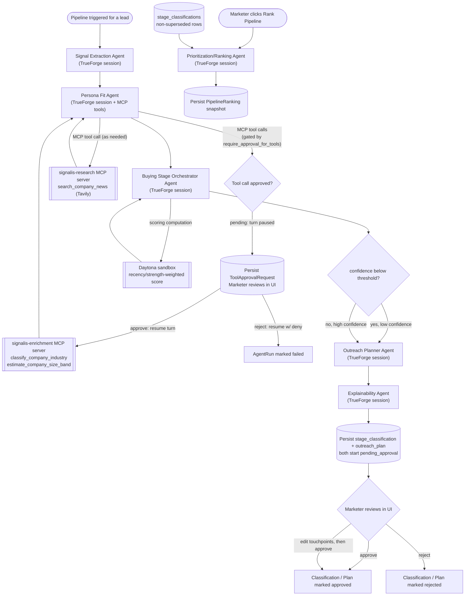

# Agent Graph

Signalis runs five agents as nodes in a LangGraph `StateGraph`, plus a sixth,
standalone Prioritization/Ranking Agent that is not part of that per-lead
graph (see "The sixth agent" below). Each node's actual reasoning executes
as a session/turn on a local TrueForge agent harness process rather than a
bare model API call. TrueForge owns the real agent loop for that step —
model calls, MCP tool discovery/execution, context management — and the
Python graph node only starts the turn and reads back its structured output
(`app/core/trueforge.py`). LangGraph remains the Python-side coordinator: it
is what decides node order and evaluates the one real conditional edge (the
confidence-threshold branch), while TrueForge is what each individual node
actually runs on.

Every "TrueForge session" box falls back to a direct Gemini call, and then
to a Hugging Face model, if TrueForge is not running or a turn fails — see
`docs/DECISIONS.md` for the fallback chain and why it exists. The
Prioritization/Ranking Agent (bottom of the diagram) runs independently of
the per-lead pipeline above it — it is triggered separately and reads across
all leads at once rather than being a node in the per-lead graph.

The tool-approval gate on Persona Fit's MCP calls only fires when the model
actually decides to call `classify_company_industry` or
`estimate_company_size_band` (typically when the lead's industry or company
size is missing or worth verifying) — most pipeline runs for a lead with
complete firmographic data never reach the `Gate` node at all, since the
agent has no reason to call either tool. See "Human-approval checkpoint"
below for the full pause/approve/reject mechanics.

## Node responsibilities and handoffs

1. **Signal Extraction Agent** receives every raw, not-yet-classified
   `signals` row for the lead (CRM fields and website events, exactly as
   ingested, including malformed or sparse ones). It returns a normalized
   `event_type` and an `intent_stage_hint` per record. Its output updates
   the `signals` rows in place and is handed forward as a summary.

2. **Persona Fit Agent** receives the lead's firmographic profile plus the
   currently active persona and solution ICP, and has two MCP servers
   attached: `signalis-enrichment` and `signalis-research`. When the lead's
   industry or company size is missing or worth verifying, it genuinely
   calls the `classify_company_industry` and/or `estimate_company_size_band`
   MCP tools before answering — this is TrueForge discovering and invoking a
   real remote tool over MCP, not a Python function call embedded in the
   agent's own code. It also has a `search_company_news` tool (served by
   `signalis-research`, backed by the live Tavily search API) available and
   calls it when recent external context — funding news, a hiring surge,
   a product launch — would genuinely sharpen the fit assessment; this is
   not called on every lead, since recent news is not always relevant or
   available. It returns a fit classification (`full_fit` / `partial_fit` /
   `mismatch`), reasoning, and any missing data it had to work around. This
   result is handed to both the Buying Stage Orchestrator (fit context
   informs how much weight to give ambiguous signals) and later to the
   Outreach Planner (fit context shapes message tone).

3. **Buying Stage Orchestrator Agent** receives the lead's full signal
   history (all `signals`, not just the newly extracted ones, within the
   configured rolling window) plus the persona fit result. Before calling
   the model, the graph node computes a recency/strength-weighted signal
   score by executing generated Python inside a Daytona sandbox
   (`app/core/sandbox.py`) — falling back to an equivalent local computation
   if the sandbox is briefly unreachable — and passes that score to the
   agent as supporting evidence. The agent then returns the overall `stage`,
   a `confidence` score, and a `justification`. This is the node whose
   confidence score drives the graph's one real conditional branch; its
   persisted output also records `signal_score_computed_via` (`"daytona"` or
   `"local"`) so which execution path actually ran is independently
   verifiable after the fact.

4. **Conditional edge**: if confidence is below
   `confidence_approval_threshold` (default 0.5, configurable), the
   classification is flagged `requires_approval=True` and its
   `approval_status` is set to `pending_approval` instead of
   `auto_approved`. Both branches still proceed to plan generation — the
   difference is purely in how the resulting classification is flagged, not
   whether a plan gets produced. See DECISIONS.md for why every plan,
   regardless of branch, still requires a separate approval step.

5. **Outreach Planner Agent** receives the stage, confidence, persona fit
   result, active persona, and active solution, and returns a 3-5 touchpoint
   micro-plan with day offsets, channels, content themes, and example
   message copy. The resulting `outreach_plans` row always starts as
   `pending_approval`. Its system instruction is deliberately task-mechanical
   only (output schema, what lead/persona context to weigh, touchpoint
   count/day-offset requirements); the actual copywriting craft guidance —
   channel-appropriate tone, referencing a buying signal without sounding
   surveillance-creepy, cadence structure, avoiding generic AI-sounding copy,
   strong-vs-weak opening line examples — lives in a TrueForge **skill**
   (`outreach-copywriting-style-guide`, `backend/app/agents/skills/
   outreach_copywriting_style_guide/SKILL.md`) that this agent has access to
   and consults on demand rather than re-sending on every call. See
   `docs/DECISIONS.md` for why, and how the direct Gemini/HF fallback path
   (which has no TrueForge skill access) is kept from regressing.

6. **Explainability Agent** receives the structured outputs of all four
   prior agents plus the `requires_approval` flag, and synthesizes a
   coherent narrative explaining the whole reasoning chain in plain
   language. This narrative is what the UI's agent trace view foregrounds
   for a fast, non-technical read of "why did the system land here."

## Runtime architecture: LangGraph coordinates, TrueForge executes

Each node function in `app/agents/graph.py` calls its corresponding agent
module (`app/agents/signal_extraction.py`, etc.), which in turn calls
`app.agents.common.run_agent_reasoning`. That function is the actual
TrueForge integration point: it registers a named TrueForge agent (once,
idempotently) with the node's system instruction and model, starts a new
session (`app.core.trueforge.run_turn`), runs one turn with the node's
prompt, and polls until the turn completes or errors. The registered
instruction always embeds the node's JSON response schema directly, so
TrueForge's model call — whichever provider it is actually routed to —
returns exactly the structured shape the rest of the pipeline expects.
`run_agent_reasoning` returns `(parsed_result, trueforge_session_id)`; every
one of the six agent modules persists that session id onto its `AgentRun`
row (`agent_runs.trueforge_session_id`, nullable) via `finish_run`. The
session id is `None` whenever the direct-Gemini/Hugging-Face fallback path
was used instead, since that path never creates a TrueForge session — see
"Follow-up questions on an agent run's own reasoning" below for what that
persisted session id is actually for.

If TrueForge is disabled (`TRUEFORGE_ENABLED=false`) or unreachable, the same
call falls back to a direct Gemini call and then a Hugging Face call
(`app/core/llm.py`), using the identical prompt and schema — this is a
transport fallback, not a second reasoning path. Because the direct fallback
has no MCP tool access, any tool-referencing instruction (Persona Fit's) is
rewritten for that path specifically to tell the model no tools are
available, rather than leaving it to try invoking tools that do not exist
in that call. The same fallback also has no access to TrueForge **skills**
(Outreach Planner's) — `run_agent_reasoning` accepts an optional
`fallback_style_guidance` string appended to the fallback instruction
specifically for this case, mirroring the tool-stripping precedent, so a
prompt whose craft guidance now lives entirely in a skill doesn't silently
lose that guidance on the fallback path.

## Human-approval checkpoint

Every outreach plan produced by the graph starts in `pending_approval`
status and never becomes usable output until a marketer explicitly approves
it via `POST /api/approvals/plans/{id}`. Separately, a low-confidence stage
classification (confidence below the threshold) is flagged
`pending_approval` at the classification level too, so a marketer can reject
the classification itself before deciding whether the plan built on top of
it makes sense. Both approval paths write an immutable `approval_events`
row.

Separately from this application-level checkpoint, TrueForge itself provides
a native per-tool human-approval primitive: an MCP server attached to an
agent can set `require_approval_for_tools`, and any matching tool call then
pauses the turn with `state.status == "done"` and
`required_actions: [{"type": "tool.approval_required", ...}]` until a
`user.tool_approval` turn input resumes it. **This is now wired into the
product** for the Persona Fit agent's two enrichment tools
(`classify_company_industry`, `estimate_company_size_band`) — see
`docs/DECISIONS.md` for the full rationale and the earlier "exercised but not
wired in" decision this supersedes.

When Persona Fit's TrueForge turn pauses on this gate,
`app.agents.common.run_agent_reasoning` raises `AgentPausedForToolApproval`
instead of returning a result; `app.services.pipeline.run_pipeline_for_lead`
catches it, persists one `ToolApprovalRequest` row per pending tool call, and
raises `PipelinePausedForApproval` so the pipeline-run endpoint reports a
clear "paused awaiting tool approval" error for that lead instead of a bare
failure. A marketer reviews the pending request inline on the Lead Detail
page (tool name and input shown verbatim) and approves or rejects it via
`POST /api/tool-approvals/{id}/approve` or `/reject`. Approving resumes the
same TrueForge turn with `previous_turn_id: "auto"` and a `user.tool_approval`
resume input, lets Persona Fit's real result complete, and persists it via
the normal `finish_run` path; rejecting resumes with `approval: {status:
"deny"}` and marks the backing `AgentRun` as failed rather than leaving it
stuck in `"running"`.

**Scope tradeoff:** approving a pending tool call completes only the Persona
Fit step of the graph — it does not automatically resume the rest of the
pipeline (Buying Stage → Outreach Planner → Explainability). The marketer
clicks the existing "Regenerate Plan" button to run the remaining steps with
the now-unblocked Persona Fit result already on record. Full mid-pipeline
resumption would require checkpointing and replaying partial LangGraph state
across an HTTP round trip, which is materially heavier than this feature's
scope justifies; this was a deliberate, documented choice, not an oversight.

## Follow-up questions on an agent run's own reasoning

A marketer reading the Agent Trace tab can ask a natural-language follow-up
question against any single trace entry that ran through TrueForge — e.g.
"why wasn't this lead classified as late-stage?" or "what would change your
mind about this lead's persona fit?" — and get back an answer that is
genuinely grounded in that agent's own prior reasoning, not a fresh
one-shot call re-fed a summary of it.

This works because TrueForge sessions are a real runtime feature
independent of Signalis's own database: TrueForge persists a session's full
turn history in its own SQLite store, and that history survives regardless
of what Signalis does with the session id afterward. Every prior integration
in this codebase (`run_turn`) created a new session for every single call
and discarded the session id once the turn finished — genuinely stateless
from TrueForge's perspective, even though TrueForge itself supports true
multi-turn conversations. `POST /api/leads/{lead_id}/agent-runs/{agent_run_id}/ask`
(`app/api/routes/agent_followups.py`) is what actually exploits that
capability: it looks up the run's persisted `trueforge_session_id` and calls
`app.core.trueforge.run_followup_turn(session_id, message)`, which posts
directly to `/api/v1/sessions/{session_id}/turns` — never
`POST /api/v1/sessions` — so the model answers as a continuation of the
exact conversation that produced the original structured output, with that
output still genuinely in its own context.

If the run's `trueforge_session_id` is null (the fallback-to-direct-Gemini
path was used, or TrueForge was disabled/unreachable for that run), the
endpoint returns `409 Conflict` rather than silently answering statelessly
or crashing — a follow-up without the original session would not actually
be "the model remembering its prior reasoning," so the endpoint says so
explicitly instead of faking it. Every question/answer pair is persisted as
an append-only `agent_run_followups` row (see `docs/DATA_SCHEMA.md`) so a
marketer's follow-up history for a trace entry survives a page reload, and
is listable via `GET /api/leads/{lead_id}/agent-runs/{agent_run_id}/followups`.

## Re-running the graph

The same graph is invoked again, unmodified, whenever new signals arrive for
a lead or a marketer asks to regenerate a plan. Each run supersedes the
lead's previous `stage_classification` and `outreach_plan` (via
`superseded_by_id` / `status="superseded"`) rather than overwriting them, so
the full decision history remains inspectable.

## The sixth agent: Prioritization/Ranking

Unlike the five agents above, the Prioritization/Ranking Agent
(`app/agents/prioritization.py`) does not run per-lead as part of the graph.
It runs once across the whole pipeline, on demand (`POST /api/ranking/run`),
over every lead's current (non-superseded) `stage_classification`. Given
every lead's stage, confidence, and justification in one prompt, it returns
a single priority order — rank 1 is who to contact first — with a specific,
non-generic reason per lead, using the same TrueForge session/turn mechanism
and Gemini→Hugging Face fallback chain as the other five agents. It
deliberately does not just sort by stage label: a high-confidence, recently
active mid-stage lead can legitimately outrank a low-confidence, stale
late-stage one, and the agent's own reasoning is expected to say so.

Results are persisted as an append-only `PipelineRanking` snapshot (see
`docs/DATA_SCHEMA.md`), the same pattern as `stage_classifications` and
`outreach_plans` — re-running the ranking creates a new snapshot rather than
mutating the previous one, so a manager can see how the priority order
shifted over time. The audit trail for this agent's own run is a regular
`agent_runs` row with `lead_id = NULL`, since it reasons about the pipeline
as a whole rather than any single lead.
