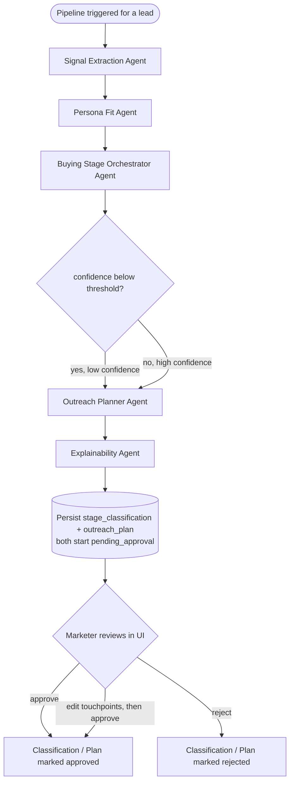

# Agent Graph

Signalis runs five agents as nodes in a LangGraph `StateGraph`. Each node
makes a real call to Gemini with a structured JSON response schema, persists
its output as an `agent_runs` row, and hands its structured output forward to
the next node via shared graph state. The orchestrator is the graph itself,
not a single agent giving orders in prose: routing is expressed as real
conditional edges evaluated on structured state, not as free-text
instructions one agent gives another.

## Node responsibilities and handoffs

1. **Signal Extraction Agent** receives every raw, not-yet-classified
   `signals` row for the lead (CRM fields and website events, exactly as
   ingested, including malformed or sparse ones). It returns a normalized
   `event_type` and an `intent_stage_hint` per record. Its output updates
   the `signals` rows in place and is handed forward as a summary.

2. **Persona Fit Agent** receives the lead's firmographic profile plus the
   currently active persona and solution ICP. It returns a fit
   classification (`full_fit` / `partial_fit` / `mismatch`), reasoning, and
   any missing data it had to work around. This result is handed to both
   the Buying Stage Orchestrator (fit context informs how much weight to
   give ambiguous signals) and later to the Outreach Planner (fit context
   shapes message tone).

3. **Buying Stage Orchestrator Agent** receives the lead's full signal
   history (all `signals`, not just the newly extracted ones, within the
   configured rolling window) plus the persona fit result. It returns the
   overall `stage`, a `confidence` score, and a `justification`. This is the
   node whose confidence score drives the graph's one real conditional
   branch.

4. **Conditional edge**: if confidence is below
   `confidence_approval_threshold` (default 0.5, configurable), the
   classification is flagged `requires_approval=True` and its
   `approval_status` is set to `pending_approval` instead of
   `auto_approved`. Both branches still proceed to plan generation — the
   difference is purely in how the resulting classification is flagged, not
   whether a plan gets produced. See DECISIONS.md for why every plan,
   regardless of branch, still requires a separate approval step.

5. **Outreach Planner Agent** receives the stage, confidence, persona fit
   result, active persona, and active solution, and returns a 3-5 touchpoint
   micro-plan with day offsets, channels, content themes, and example
   message copy. The resulting `outreach_plans` row always starts as
   `pending_approval`.

6. **Explainability Agent** receives the structured outputs of all four
   prior agents plus the `requires_approval` flag, and synthesizes a
   coherent narrative explaining the whole reasoning chain in plain
   language. This narrative is what the UI's agent trace view foregrounds
   for a fast, non-technical read of "why did the system land here."

## Human-approval checkpoint

Every outreach plan produced by the graph starts in `pending_approval`
status and never becomes usable output until a marketer explicitly approves
it via `POST /api/approvals/plans/{id}`. Separately, a low-confidence stage
classification (confidence below the threshold) is flagged
`pending_approval` at the classification level too, so a marketer can reject
the classification itself before deciding whether the plan built on top of
it makes sense. Both approval paths write an immutable `approval_events`
row.

## Re-running the graph

The same graph is invoked again, unmodified, whenever new signals arrive for
a lead or a marketer asks to regenerate a plan. Each run supersedes the
lead's previous `stage_classification` and `outreach_plan` (via
`superseded_by_id` / `status="superseded"`) rather than overwriting them, so
the full decision history remains inspectable.
