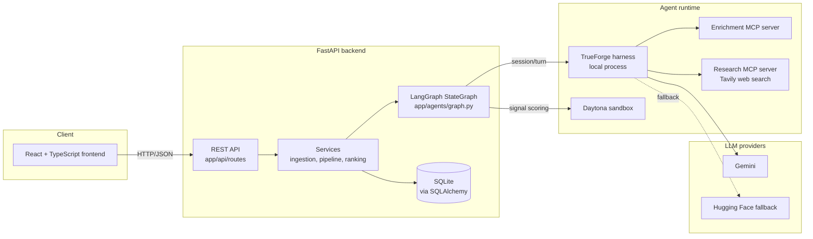

# Architecture

This document is the system-level map: how the major pieces fit together
and why they're shaped the way they are. For deeper detail on any one
piece, see the linked document.

## System diagram

## Request flow, end to end

1. A marketer loads sample data or uploads a CRM export + website event log
   through the frontend's Data Sources screen. The backend's ingestion
   service (`app/services/ingestion.py`) parses both into normalized `Lead`
   and `Signal` rows, tolerating missing or malformed fields rather than
   failing the whole batch.
2. Triggering the pipeline (per-lead or for the whole list) runs
   `app/services/pipeline.py`, which invokes the LangGraph `StateGraph`
   (`app/agents/graph.py`) for each lead.
3. Each of the five graph nodes — Signal Extraction, Persona Fit, Buying
   Stage Orchestrator, Outreach Planner, Explainability — delegates its
   actual reasoning to a session/turn on the local TrueForge harness rather
   than calling an LLM SDK directly. See
   [AGENT_GRAPH.md](AGENT_GRAPH.md) for the full node-by-node breakdown and
   the one real conditional edge (the confidence-threshold branch).
4. The Persona Fit node's reasoning is grounded by genuine tool calls through
   TrueForge's MCP layer to two remote servers: an enrichment server
   (`app/mcp_tools/enrichment_server.py`) for firmographic classification,
   and a research server (`app/mcp_tools/research_server.py`) that calls the
   live Tavily search API for recent company news, funding, and hiring
   signals — neither is an in-process function call embedded in the agent's
   own code.
5. The Buying Stage node's signal-strength score is computed by running
   generated Python inside a Daytona sandbox (`app/core/sandbox.py`), with
   an equivalent local fallback if the sandbox is briefly unreachable.
   Which path actually ran is recorded on the agent run.
6. Every graph run persists a `StageClassification` and `OutreachPlan` as
   new, append-only rows (never mutated in place — see
   [DATA_SCHEMA.md](DATA_SCHEMA.md)), plus an `AgentRun` row per node
   capturing its reasoning, so the full decision trail is inspectable from
   the Agent Trace tab on the frontend.
7. Any classification the model itself was unconfident about, and every
   generated outreach plan, is persisted as `pending_approval` and requires
   an explicit human approve/reject action before being treated as final.
8. The standalone Prioritization/Ranking Agent runs independently of the
   per-lead graph, over the whole pipeline at once, producing a
   `PipelineRanking` snapshot — an ordered, explainable "who to contact
   first" list, not a raw sort by stage or confidence.

## Why TrueForge sits between the graph and the model

Early in development, agent reasoning called an LLM SDK directly from
Python. That was replaced with TrueForge as the actual agent runtime: every
node's reasoning step is a session/turn on a locally running TrueForge
process, which owns the real agent loop — model calls, MCP tool discovery
and execution, context management — while the Python-side LangGraph
`StateGraph` remains responsible only for node ordering and the
confidence-threshold branch. The practical effect is that MCP tool use and
provider fallback are handled once, in TrueForge, rather than reimplemented
per agent in Python.

## Why Gemini falls back to Hugging Face, not to a canned response

If TrueForge is unreachable, or a turn fails after retries, the same
reasoning call falls back first to a direct Gemini call, then to a Hugging
Face model using OpenAI-compatible tool calling. No layer of this chain
returns templated or hardcoded output — every classification, fit
assessment, plan, and narrative is a real model call over real data, even
in the degraded path. This matters for the product's core claim
(explainable, model-grounded reasoning) staying true under partial outage.

## Why classifications and plans are append-only

The *content* of a stage classification or outreach plan is never updated
in place — a new pipeline run always inserts a new row rather than
rewriting an existing one's stage, confidence, justification, or
touchpoints. The only mutation applied to a prior row is a supersession
marker: the old classification's `superseded_by_id` is set to the new
row's id, and the old plan's `status` is set to `"superseded"`
(`app/services/pipeline.py`). This means:

- The full reasoning history behind a lead's current state is always
  reconstructable, not just the latest snapshot.
- The Classification History and Agent Trace tabs in the frontend have
  something real to show — they read history, not a log table bolted on
  separately.
- A re-run after a new signal arrives doesn't need special-cased "update"
  logic distinct from the first run.

See [DATA_SCHEMA.md](DATA_SCHEMA.md) for the full table-by-table schema.

## Frontend architecture

React 18 + Vite + TypeScript, Tailwind CSS, and a component library built
on Radix primitives in the shadcn/ui pattern — owned in this codebase under
`frontend/src/components/ui/`, not an installed black box, so every
primitive can be adjusted to the app's own design tokens
(`frontend/src/index.css`). Data fetching goes through TanStack Query
(`frontend/src/api/`), with every query in the app expected to handle
loading, error, and empty states as three distinct branches — not just
loading-vs-data — since a collapsed distinction here has previously caused
real bugs (a failed request rendering as "not found" instead of a visible
error). See [frontend/README.md](../frontend/README.md) for a
directory-level tour.

## Where to go next

- [AGENT_GRAPH.md](AGENT_GRAPH.md) — full agent graph diagram and
  per-node handoff description.
- [DATA_SCHEMA.md](DATA_SCHEMA.md) — every table, column, and the
  append-only rationale in detail.
- [API.md](API.md) — every REST endpoint.
- [TIME_SAVINGS.md](TIME_SAVINGS.md) — how the manual-vs-agent time
  comparison shown on the dashboard is computed.
- [../backend/README.md](../backend/README.md) and
  [../frontend/README.md](../frontend/README.md) — component-level setup
  and directory structure.
